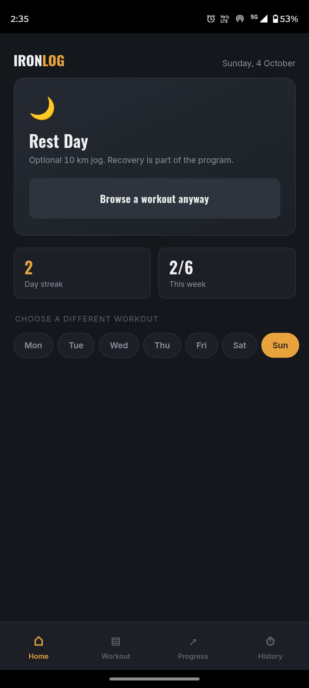
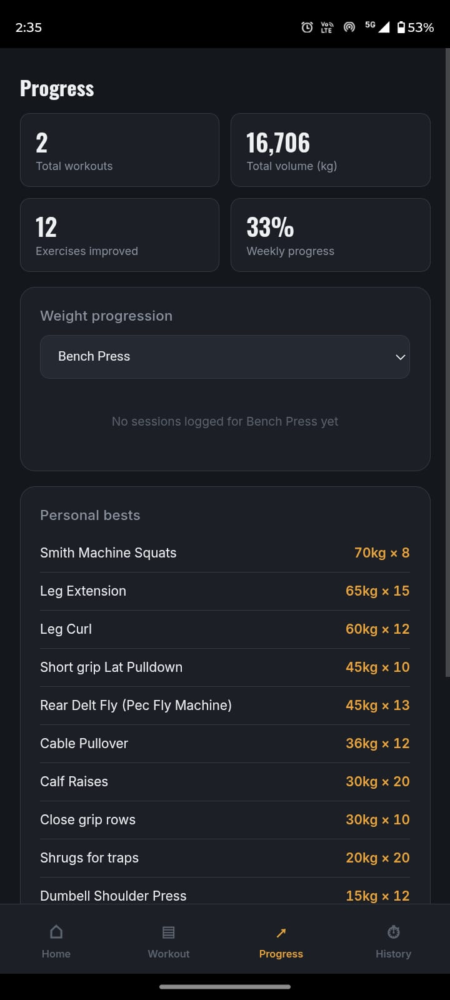
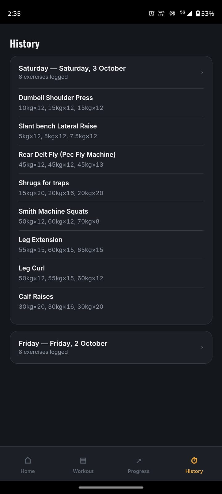

# 🏋️ Iron Log — Workout Tracker

An offline-first Android app for logging workouts and tracking progressive overload. Open it, log your sets, and watch your numbers climb. No account, no internet, no tracking.

<!-- Add screenshots here:    -->

## Features
- **Weekly split:** a preloaded plan, fully editable
- **Custom workouts:** add, edit, reorder or remove exercises on any day, including rest days
- **Per-exercise settings:** weight, target reps, number of sets and weight increment
- **Auto progression:** hit your target reps on all sets and the next session's weight goes up automatically
- **Rep-goal exercises:** e.g. high-rep squats tracked by total reps
- **Previous performance** shown right beside today's inputs
- **Progress dashboard:** total workouts, volume, exercises improved and weekly completion
- **Charts:** top weight, volume and estimated 1RM per exercise
- **Personal bests and workout history**
- **Streaks** that skip your rest days
- **Backup and restore:** export your data through the Android Share sheet, import it back later
- **Works fully offline:** all data and fonts live on the device

## Tech stack
| Layer | Tool |
|---|---|
| UI | HTML, CSS, vanilla JavaScript (single file) |
| Storage | `localStorage` (on-device) |
| Android wrapper | Capacitor 6 (Filesystem and Share plugins) |
| CI/CD | GitHub Actions |
| Build | Gradle (debug APK) |

## How the build works
```
git push → GitHub Actions
   → patch app for offline use (bundle fonts, native export)
   → npm install → cap add android → generate icons
   → cap sync → gradle assembleDebug
   → app-debug.apk uploaded as a build artifact
```

## Install the APK
1. Open the **Actions** tab and click the latest successful **Build APK** run
2. Download **iron-log-apk** from Artifacts and unzip it
3. Send `app-debug.apk` to your phone and tap it
4. Allow *Install unknown apps* if asked, then tap Install

> This is a debug build for personal use, not a Play Store release.

## Project structure
```
├── www/                 # the app (index.html, fonts, native export helper)
├── assets/              # app icon sources
├── capacitor.config.json
├── package.json
└── .github/workflows/   # APK build pipeline
```

## Development
Edit `www/index.html`, push to `main`, and a new APK is built automatically. Install it over the old one to keep your data.

## Roadmap
- Rest timer
- Delete or edit past sessions
- Signed release build

## Preview




